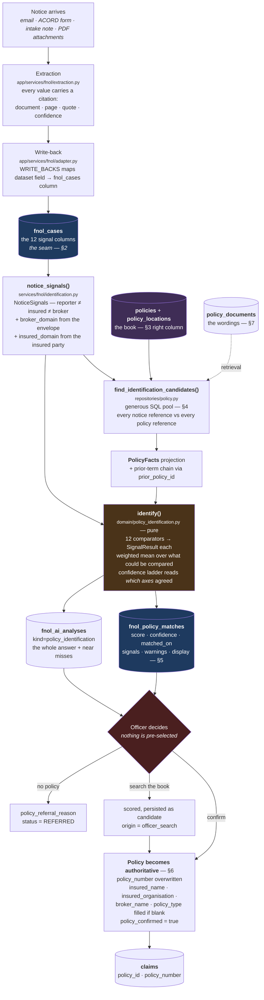
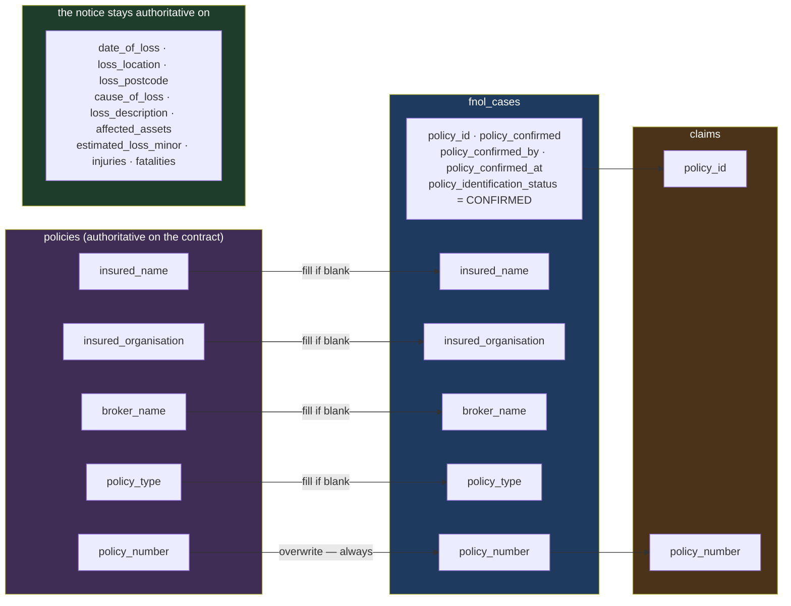

# Policy matching: the field reference

Which fields identify a policy, which fields the notice contributes, and which
fields the policy hands back once an officer confirms it.

[policy-identification.md](policy-identification.md) describes the *engine* — the
signals, the ladder, the screen. This document is the **field-level companion**:
every column that participates, on which side, at which stage, and why it earns
its place. Read it when adding a signal, debugging a match that should have been
found, or explaining to an underwriter why a candidate scored what it did.

The governing rule, stated once because everything below follows from it:

> **A value is a matching signal once it has a `fnol_cases` column.** Everything
> else the extractor read is stored, cited, and shown on screen — and never
> matched on. "Which extracted fields matter for identification" is a structural
> question, not a conventional one.

---

## The three questions this document answers

| Question | Direction | Section |
|---|---|---|
| What do we compare, and against what? | notice ⟷ policy | [§3](#3-the-matching-signals-notice--policy) |
| What does the notice contribute? | notice → match record | [§2](#2-the-notice-side-fields-read-from-the-fnol-case), [§5](#5-what-the-notice-populates-the-match-record) |
| What does the policy hand back? | policy → case → claim | [§6](#6-what-the-policy-populates-inheritance-on-confirmation) |

---

## 1. The flow



**Where each stage lives**

| Stage | Module |
|---|---|
| Read the notice, cite every value | `app/services/fnol/extraction.py` |
| Land values on columns | `app/services/fnol/adapter.py` — `WRITE_BACKS` |
| Build `NoticeSignals` | `app/services/fnol/identification.py` — `SIGNAL_SOURCES` |
| Fetch the pool | `app/repositories/policy.py` — `find_identification_candidates()` |
| Compare and rank | `app/domain/policy_identification.py` — `SIGNALS`, `_COMPARATORS` |
| Persist, confirm, refer | `app/services/fnol/identification.py` |

---

## 2. The notice side: fields read from the FNOL case

Every row here is a column on `fnol_cases`, populated by the extractor through
`WRITE_BACKS`, and read by `SIGNAL_SOURCES` with the citation that lets the
officer click a reason and land on the highlighted passage.

### Fields that become signals

| `fnol_cases` column | Dataset field key | Feeds signal | Why it identifies a policy |
|---|---|---|---|
| `policy_number` | `policy.policy_number` | `policy_number` | The one identifier meant to be unique. Also the field brokers most often put something *else* in — which the engine detects rather than punishes |
| `broker_reference` | `policy.broker_reference` | `broker_reference` | The broking house's own scheme reference. Frequently the only reference on the notice, because it is what the broker's system prints |
| `insured_name` | `policy.insured_name` | `insured_name` | Who the client is. Compared with `entity_similarity` against **every** party the policy insures, not just the first name on the declarations |
| `insured_organisation` | `policy.insured_organisation` | `insured_organisation` | The legal entity behind a trading name. Distinguishes group companies that share a brand |
| `broker_name` | `policy.broker_name` | `broker_name` | Corroborating, not identifying — a broker places many policies, so it narrows rather than resolves |
| `project_name` | `project.project_name` | `project_name` | On a construction risk the project *is* the risk. Often more reliable than the insured's name |
| `contract_number` | `project.contract_number` | `contract_number` | The contract reference a construction desk quotes instead of a policy number |
| `loss_location` | `loss.loss_location` | `risk_location` (fallback) | Where the loss happened, compared against the whole schedule |
| `risk_location` | `loss.risk_location` | `risk_location` (primary) | The insured site as the notice names it, when it differs from where the loss occurred |
| `loss_postcode` | `loss.loss_postcode` | `risk_location` (first pass) | The highest-value token in an address. Compared on the outward code, against `policy_locations` |
| `date_of_loss` | `loss.date_of_loss` | `policy_period` | Places the loss in a term — or in last year's, or in the defects liability period |
| `line_of_business` | *(classification, not extraction)* | `line_of_business` | A weak filter deliberately — classification is itself inferred, so it carries weight 0.6 |
| `policy_period_stated` | `policy.policy_period_stated` | *(context only)* | What the notice claims the term is. Shown to the officer; not scored, because the policy is the authority on its own dates |
| `cause_of_loss` | `loss.cause_of_loss` | *(warnings only)* | Drives `peril_not_listed` / `peril_excluded` warnings, which change no rank |

### Fields that become signals without an extractor

These two have no dataset field and therefore no clickable citation — the panel
offers no link rather than a dead one.

| Value | Where it comes from | Feeds signal |
|---|---|---|
| Sender domain | `source_metadata.sender` → `source_metadata.from` → `reporter_email` | `broker_domain` |
| Insured's email domain | `fnol_parties` where `role == "insured"` and `email` is set | `insured_domain` |

> **The sender is not the insured.** 60–85% of commercial notices arrive from a
> broking house. The envelope's domain is evidence about the **broker**; the
> insured's domain has to come from a party recorded as the insured, or it does
> not exist. One combined "email" signal would compare the broking house's domain
> to the client's and score the mismatch as a fact about the client. The reporter
> is held apart from both — `reporter_name`, `reporter_organisation`,
> `reporter_role`, `reporter_email`, `reporter_phone` are provenance, never
> identity.

### Notice fields deliberately *not* matched on

Extracted, stored, cited, shown — and excluded from identification on purpose.

| Field | Why excluded |
|---|---|
| `loss_description`, `affected_assets` | Prose. Would inject narrative similarity into an identity score |
| `estimated_loss_minor`, `repair_estimate_minor` | Read by the `exceeds_limit` **warning**, not by any signal. A large loss is not evidence of which policy it falls under |
| `injuries`, `fatalities`, `business_interruption`, `structural_damage`, `environmental_exposure` | Severity and triage inputs |
| `police_reference`, `incident_reference` | Third-party references that appear in no policy book |
| `project.contract_parties` | The notice's side of joint names — kept as provenance an officer reads; matching compares against the *policy's* `principal_name` / `contractor_name` |
| `reporter_*` | Provenance. See the box above |

---

## 3. The matching signals: notice ⟷ policy

Twelve signals, heaviest first — which is also the order the review panel lists
them in. The **axis** matters as much as the weight: two signals agreeing across
*different* axes is worth far more than two agreeing on the same one, and the
confidence ladder reads the axes rather than only the total.

| # | Signal | W | Axis | Notice field | Policy field(s) | How compared |
|---|---|---|---|---|---|---|
| 1 | `policy_number` | 5.0 | policy | `policy_number` | `policies.policy_number`, then `broker_reference` / `contract_number` / `project_reference` as a rescue | exact (1.0) → OCR-folded `0/O 1/I 5/S 8/B` (0.9) → containment ≥5 chars (0.75) → edit distance ≤2 (0.55) → *is it another of this policy's references?* → mismatch |
| 2 | `broker_reference` | 2.5 | broker | `broker_reference`, or `policy_number` when it is really a scheme ref | `policies.broker_reference` | normalised equality |
| 3 | `contract_number` | 2.2 | project | `contract_number` | `policies.contract_number`, `project_reference` | normalised equality · construction lines only |
| 4 | `insured_name` | 2.0 | insured | `insured_name` | `joint_names()` — `insured_name`, `insured_organisation`, `principal_name`, `contractor_name` | `entity_similarity`; a strict subset is capped below the match threshold |
| 5 | `project_name` | 1.6 | project | `project_name` | `policies.project_name`, `site_address` | name similarity · construction lines only |
| 6 | `policy_period` | 1.5 | cover | `date_of_loss` | `effective_date`, `expiry_date`, `practical_completion_date` + `maintenance_period_months`, `prior_policy_id` | five outcomes — see below |
| 7 | `risk_location` | 1.3 | risk | `loss_postcode` → `risk_location` → `loss_location` | `policy_locations.postcode` / `.address`, then `primary_location`, `site_address` | best across the **whole schedule**; postcode first; names the entry that matched |
| 8 | `insured_organisation` | 1.2 | insured | `insured_organisation` | `joint_names()` | `entity_similarity` |
| 9 | `insured_domain` | 1.0 | insured | insured party's email | `policies.insured_domain`, `insured_email` | domain equality; generic domains (gmail, outlook…) neutralised |
| 10 | `broker_domain` | 1.0 | broker | envelope sender | `policies.broker_domain` | domain equality |
| 11 | `broker_name` | 0.9 | broker | `broker_name` | `policies.broker_name` | name similarity |
| 12 | `line_of_business` | 0.6 | cover | `line_of_business` | `policies.line_of_business` | equality; construction ≡ engineering |

### The date of loss: five outcomes, not two

| Outcome | Score | Why it exists |
|---|---|---|
| `in_force` | 1.0 | the ordinary case |
| `in_maintenance_period` | 1.0 | a construction defect found after practical completion is in cover |
| `prior_term` | 0.3 | losses are discovered late; the useful answer is last year's policy, not "uninsured" |
| `outside_period` | 0.0 | shown, never hidden — that is a coverage conversation |
| `unknown` | — | not compared, and said so |

### Three distinctions the field table cannot show

**`match` ≠ `partial` ≠ `mismatch` ≠ `not_compared` ≠ `missing`.** A signal never
returns a bare float. "The broker was not stated on the notice" is a gap an
officer can go and fill; "neither side carries a contract number" is a signal that
does not apply to this risk. Both are dropped from the weighted mean — a sparse
notice is not punished for being sparse — and both are *listed*.

**A reference in the wrong field is one fact, not two.** When the notice's stated
policy number turns out to be the policy's broker reference, it is scored on
signal 2 and signal 1 reports `not_compared` *with the reason*. Counting it as a
match and a mismatch at once would punish the right policy for identifying itself.

**Warnings are not scores.** `policy_not_active`, `outside_policy_period`,
`prior_term`, `line_of_business_mismatch`, `identity_conflict`, `peril_not_listed`,
`peril_excluded`, `exceeds_limit` sit beside the reasons and change no rank. A
candidate can be certainly the right policy and a poor answer to this loss.

---

## 4. Narrowing: the fields that hit the database

`find_identification_candidates()` is generous on purpose — it decides what gets
*scored*, never what wins. Only these fields reach SQL:

| Parameter | Searched against |
|---|---|
| `policy_number`, `broker_reference`, `contract_number` | **all four** of `policy_number`, `broker_reference`, `contract_number`, `project_reference` — three by three, because the notice's labels are unreliable and the policy's are not (min. 4 chars, normalised, `LIKE %…%`) |
| `insured_name`, `organisation` | `insured_name`, `insured_organisation`, `principal_name`, `contractor_name` |
| `broker_name` | `broker_name` |
| `broker_domain` | `broker_domain` |
| `insured_domain` | `insured_domain`, `insured_email LIKE %@domain` |
| `project_name` | `project_name`, `site_address` |
| `postcode` / `location` | outward code against `policy_locations.postcode`, then `primary_location`, `site_address` |

**When nothing identifying was read**, the clause list is empty and the query
falls back to `country` + `line_of_business` + *in force on the loss date* — the
policies that could have answered this loss at all, rather than the whole book or
nothing. The identification gate still rejects every one of them unless something
about the client agrees.

Pool ceiling: `CWB_FNOL_POLICY_IDENTIFICATION_POOL_LIMIT`, default 250.

---

## 5. What the notice populates: the match record

One row per candidate on `fnol_policy_matches`, written by the engine and read by
the review screen. Stored rather than recomputed, so what an officer saw when they
bound a policy is recoverable years later.

| Column | Holds | Why stored |
|---|---|---|
| `score` | weighted mean over the signals that could be compared | not a probability, and the footer says so |
| `confidence` | `exact` \| `strong` \| `possible` \| `weak` \| `rejected` | the ladder's judgement — read §"Confidence is a ladder" in [policy-identification.md](policy-identification.md) |
| `match_strength` | the coarse four-band form | for the queue and the exception engine |
| `matched_on` | `{"policy_number": 1.0, "insured_name": 0.82, …}` | flat per-signal scores for the queue and the audit trail |
| `signals` | full working per signal: outcome, weight, both sides' values, the sentence, the dataset field key | this is what the candidate card renders, and what makes each reason clickable |
| `warnings` | coverage plausibility, kept apart from identity | so a coverage doubt never quietly lowers a rank |
| `display` | `insured_name`, `line_of_business`, `policy_type`, `policy_period`, `status`, `limit_minor`, `excess_minor`, `currency`, `location`, `location_label`, `broker_name`, `project_name`, `contract_number` | the card's face, formatted once on the server — and the **matched** location's own limit and excess, not the policy headline's |
| `period_outcome` | the five-way date outcome | |
| `origin` | `engine` \| `officer_search` \| near miss | a manually found policy is persisted as a candidate before it can be bound |
| `recommended` | the engine put it forward | never the same thing as `selected` |
| `selected`, `selected_by`, `selected_at` | the officer's act | |

The whole answer, near misses included, also lands in `fnol_ai_analyses` with
kind `policy_identification`. Near misses live there and not in the candidate
table on purpose: they were compared and *rejected*, so they are an explanation,
not an option.

---

## 6. What the policy populates: inheritance on confirmation

`PolicyIdentificationService.confirm()`. Once an officer confirms, the policy —
not the broker's spelling of it — is the authority on the contract's identity.



| Case column | Rule | Why that rule |
|---|---|---|
| `policy_number` | **overwritten** from `policies.policy_number` | the book's spelling is canonical; the notice's may be OCR-damaged or a broker reference |
| `insured_name` | filled **only if blank** | an officer may already have corrected it, and a correction outranks a copy |
| `insured_organisation` | filled only if blank | same |
| `broker_name` | filled only if blank | same |
| `policy_type` | filled only if blank | same |
| `policy_id` | set | *not* authoritative on its own — `policy_confirmed` is |
| `policy_confirmed`, `policy_confirmed_by`, `policy_confirmed_at` | set | a human-entered value has an author, not a confidence |
| `policy_identification_status` | `CONFIRMED` | whether the *question* is settled is a different axis from whether a policy is bound |
| `policy_referral_reason`, `policy_referred_by` | cleared | |

**Everything about the loss is left alone.** The notice is the authority on what
happened; the policy has nothing to say about it.

**Auto-bind without confirmation.** An unambiguous match writes `case.policy_id`
so coverage can say "review required" rather than "no policy located".
`policy_confirmed` stays `false`, and that — not `policy_id` — is what everything
downstream treats as authoritative.

**On to the claim.** `create_claim` refuses without `case.policy_id`
(`code="policy_required"`) and copies `policy_id` and `policy_number` onto the
claim record.

### The safety rule

> An AI never introduces a policy. Candidates come *from* the repository, so a
> hallucinated policy number cannot become a policy match — it can only fail to
> match one.

`confirm()` refuses any `policy_id` that does not resolve to a row in the book. It
does **not** require the policy to have been ranked: an officer who found the right
one by hand gets it scored and persisted as a candidate with
`origin = "officer_search"` *before* it is bound.

---

## 7. The policy-document library (in progress)

The book above is structured reference data. The library is the **wordings** — the
PDFs in `policy/` — ingested so a match can be evidenced with the clauses it was
retrieved by, and so matching works on a deployment whose policy administration
system exports nothing.

`app/models/policy_document.py` mirrors `fnol_documents` / `fnol_document_chunks`
in shape and keeps a separate lifecycle: a wording belongs to no case and outlives
every notice matched against it.

**The six promoted columns.** Everything the reader finds goes into
`extracted_metadata` (JSONB); only these are lifted to columns, because these are
what the matcher *filters and corroborates* on — the same seam `fnol_cases` draws:

| `policy_documents` column | Role |
|---|---|
| `policy_number` | resolves the document to a row in `policies`; `policy_id` is nullable and linking is an *outcome* of ingestion, not a precondition |
| `insured_name` | corroboration when no number resolves |
| `insurer_name` | display and disambiguation |
| `broker_name` | corroboration |
| `line_of_business` | the **filter** that matters — a policy of the wrong line is not a weaker answer, it is not an answer |
| `policy_type` | display |
| `effective_date` / `expiry_date` | term filtering against the date of loss |

Everything else the reader found — additional named insureds, scheduled premises,
limits, sublimits, deductibles, coinsurance, valuation basis, covered causes,
exclusions, endorsement schedules, warranties, loss payees, equipment schedules —
stays in `extracted_metadata`: shown on screen, not matched on.

**The vector payload carries filter keys and no text.** Postgres owns the excerpt.
Qdrant's payload holds `chunk_ref`, `policy_document_id`, `policy_id`,
`policy_number`, `line_of_business`, `content_hash`, `page_number`,
`section_label`, `effective_date`, `expiry_date` — indexed because a filter on an
unindexed payload key is a scan.

Chunk offsets (`char_start` / `char_end`, `page_number`, `page_from` / `page_to`)
are what turn a retrieved clause into a highlight on the page.

Settings live in `PolicyLibrarySettings` (`CWB_POLICY_*`) — separate from
`DocumentIntelligenceSettings` because the corpus, the collection and the
thresholds all differ, while the embedding provider is deliberately shared.

---

## 8. Adding a signal

Four edits, in this order:

1. **Ask for it** — a field in `app/data/extraction_schemas/fnol_notice.json`. The
   `description` is used verbatim as the retrieval query, so write it in the
   vocabulary a document uses.
2. **Land it** — a `WriteBack` entry in `app/services/fnol/adapter.py` naming the
   column and the parser.
3. **Hold it** — a column on `FNOLCase`, plus an Alembic migration.
4. **Compare it** — a `SignalDefinition` in `SIGNALS`, a comparator in
   `_COMPARATORS`, its "not stated" wording in `_NOT_STATED`, and an entry in
   `SIGNAL_SOURCES` so the value arrives with its citation.

`evidence_field_key` is what makes the new reason clickable. A signal with no
document behind it holds `None`.

---

## 9. Cheat sheet

```
NOTICE (fnol_cases)                    POLICY (policies + policy_locations)
──────────────────────────────────     ──────────────────────────────────────
policy_number ───────── 5.0 ─────────► policy_number ⤵ broker_reference
                                                      ⤵ contract_number
                                                      ⤵ project_reference
broker_reference ────── 2.5 ─────────► broker_reference
contract_number ─────── 2.2 ─────────► contract_number · project_reference
insured_name ────────── 2.0 ─────────► insured_name · insured_organisation
                                       · principal_name · contractor_name
project_name ────────── 1.6 ─────────► project_name · site_address
date_of_loss ────────── 1.5 ─────────► effective_date · expiry_date
                                       · practical_completion + maintenance
                                       · prior_policy_id
loss_postcode ─┐
risk_location ─┼────── 1.3 ─────────► policy_locations.postcode/.address
loss_location ─┘                       · primary_location · site_address
insured_organisation ── 1.2 ─────────► insured_organisation (+ joint names)
insured party email ─── 1.0 ─────────► insured_domain · insured_email
envelope sender ─────── 1.0 ─────────► broker_domain
broker_name ─────────── 0.9 ─────────► broker_name
line_of_business ────── 0.6 ─────────► line_of_business

           ── confirm ──►  policy_number (overwrite)
                           insured_name · insured_organisation ·
                           broker_name · policy_type  (fill if blank)
```

---

## Related

- [policy-identification.md](policy-identification.md) — the engine, the ladder, the API, the review stage
- [extraction-review.md](extraction-review.md) — how a value is read and cited
- [mail-intake.md](mail-intake.md) — how the notice arrives
- [architecture.md](architecture.md) — the layering
- `../policy/README.md`, `../case_data/README.md` — the 12 wordings and 24 notices, and the matching answer key
